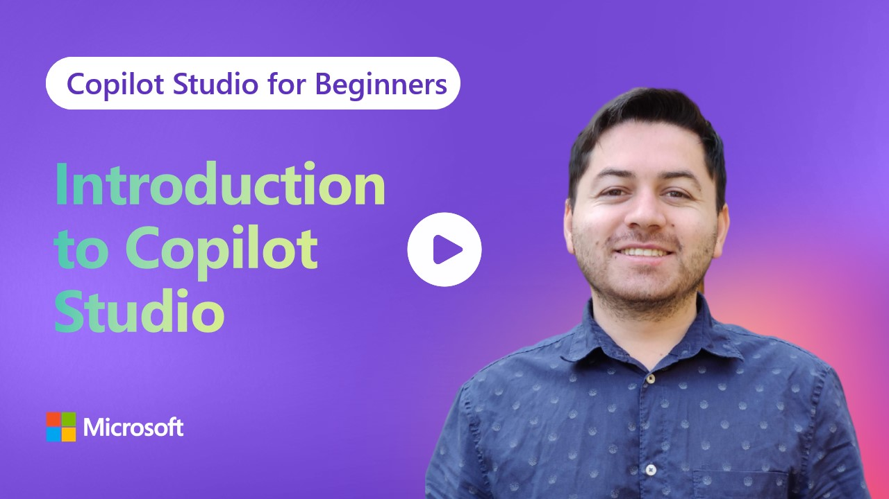

# Introduction to Copilot Studio – Communication Agents

> _Click the image to jump straight to the episode on YouTube._

Welcome! 👋  
This repo accompanies the first video in the **Introduction to Copilot Studio** series, focused on building **communication-first agents** (think: email/SMS/voice agents powered by Copilot Studio). In this lesson, we set the stage: what Copilot Studio is and a quick guided tour of the core features you’ll use in the series.

---

## What this lesson covers

- **What Copilot Studio is**
  - What Copilot Studio can do  
  - What kind of agents we can build
- **A guided walkthrough of the product**
  - The Copilot Studio home, solutions, and agent workspace  
  - Topics & flows
  - Actions/plugins & connectors  
  - Activity & Analytics  
  - Where to publish & Channels

> **Outcome:** After this lesson, you’ll know what Copilot Studio can do, key concepts you’ll use throughout the series, and how we’ll approach building **communication agents** step-by-step.

---

## Who this is for

This series is aimed at beginners who are new to Copilot Studio and the agent creation process. Familiarity with a programming language will be helpful such as Python, C#, etc.

- Developers & technical practitioners new to Copilot Studio
- Builders who want practical, communication-centric agent workflows

---

## Prerequisites

- A Microsoft work/school account with access to Copilot Studio  
- Basic familiarity with modern LLM concepts (helpful but not required)
