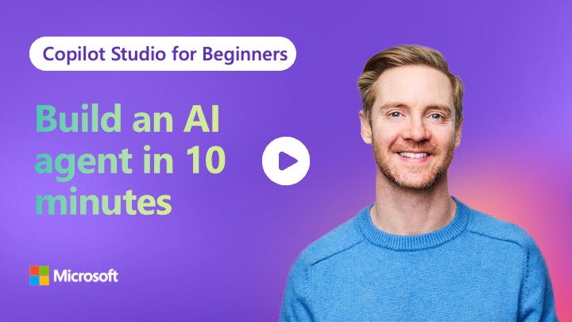

# Episode 2: Build an AI Agent in 10 Minutes

> _Click the image to jump straight to the episode on YouTube._

Welcome back to Copilot Studio for Beginners! In this episode, we're building your first AI agent from scratch - a conference room booking assistant that answers questions intelligently and handles structured workflows.

Don't be intimidated by the word "agent" - it's just an AI assistant with knowledge and abilities. You'll build one in about 10 minutes using plain English. No coding required.

---

## What this lesson covers

- **Creating Your First Agent**
  - Build agents using natural language descriptions
  - Set up agent instructions and configuration
- **Adding Knowledge Sources**
  - Upload documents to ground agent responses
  - Understand knowledge vs. generated content
- **Knowledge vs Topics**
  - Knowledge: flexible Q&A from documents
  - Topics: structured workflows with conditional logic
- **Publishing to Microsoft Teams**
  - Make your agent available to teammates
  - Test in real Teams environment

> **Outcome:** After this lesson, you'll have built a working conference room booking assistant that combines flexible knowledge-based responses with structured topic workflows, and you'll understand the core building blocks of Copilot Studio agents.

---

## Prerequisites

- Microsoft 365 account with Copilot Studio access
- Episode 1 (optional but recommended)

## Resources in This Repo

- **`agent-prompts.md`** - All prompts and descriptions used in Copilot Studio during the walkthrough
- **`knowledge-source.md`** - Conference room knowledge document in markdown format
- **`resources/`** - Folder containing downloadable files for the tutorial
  - `knowledge-source.docx` - Conference room knowledge document to upload directly to Copilot Studio

## Follow Along

1. Watch the episode video
2. Use the prompts from `agent-prompts.md` in Copilot Studio
3. Download `resources/knowledge-source.docx` to upload as a knowledge source
4. Follow the step-by-step instructions in the video

## Useful Links

- [Copilot Studio Fundamentals](https://learn.microsoft.com/en-us/microsoft-copilot-studio/fundamentals-get-started)
- [Creating Your First Agent](https://learn.microsoft.com/en-us/microsoft-copilot-studio/fundamentals-get-started)

---

**Next episode:** We're adding email capabilities so your agent can send booking details directly to users.