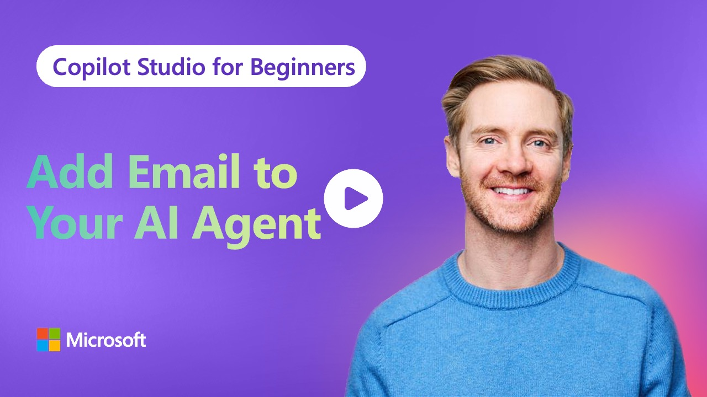

# Episode 3: Build Your First AI Email Agent

> _Click the image to jump straight to the episode on YouTube._

Welcome to Episode 3 of Copilot Studio for Beginners! We're adding email capabilities to the conference room agent we built in Episode 2. Your agent won't just answer questions anymore - it'll take actions and send information directly to users.

This episode shows you how to add multiple tools to your agent and have it intelligently choose which one to use based on the conversation. All without writing code.

---

## What this lesson covers

- **Adding Email Tools**
  - Connect Office 365 Outlook to your agent
  - Configure dynamic vs. static email content
  - Use HTML formatting for readable emails
- **Multiple Actions, One Agent**
  - Add multiple tools that serve different purposes
  - Let your agent choose the right tool based on context
  - Update agent instructions to control tool behavior
- **Dynamic vs. Static Content**
  - When to let AI generate email content
  - When to use pre-written templates
  - Best practices for each approach

> **Outcome:** After this lesson, you'll have an agent that can send both targeted recommendations and complete room guides via email. You'll understand how to add actions to your agents and control when they're used.

---

## Prerequisites

- Microsoft 365 account with Copilot Studio access
- Episode 2 (building your first agent) - required for this episode
- Episode 1 (optional)

## Resources in This Repo

- **`agent-instructions.md`** - Complete agent instructions and tool configurations used in the episode
- **`email-templates.md`** - HTML email templates for the static email tool

## Follow Along

1. Watch the episode video
2. Use the instructions from `agent-instructions.md` to configure your agent
3. Copy the email templates from `email-templates.md` when setting up the static email tool
4. Follow the step-by-step instructions in the video

## Useful Links

- [Copilot Studio Actions](https://learn.microsoft.com/en-us/microsoft-copilot-studio/advanced-use-actions)
- [Office 365 Outlook Connector](https://learn.microsoft.com/en-us/connectors/office365/)

---